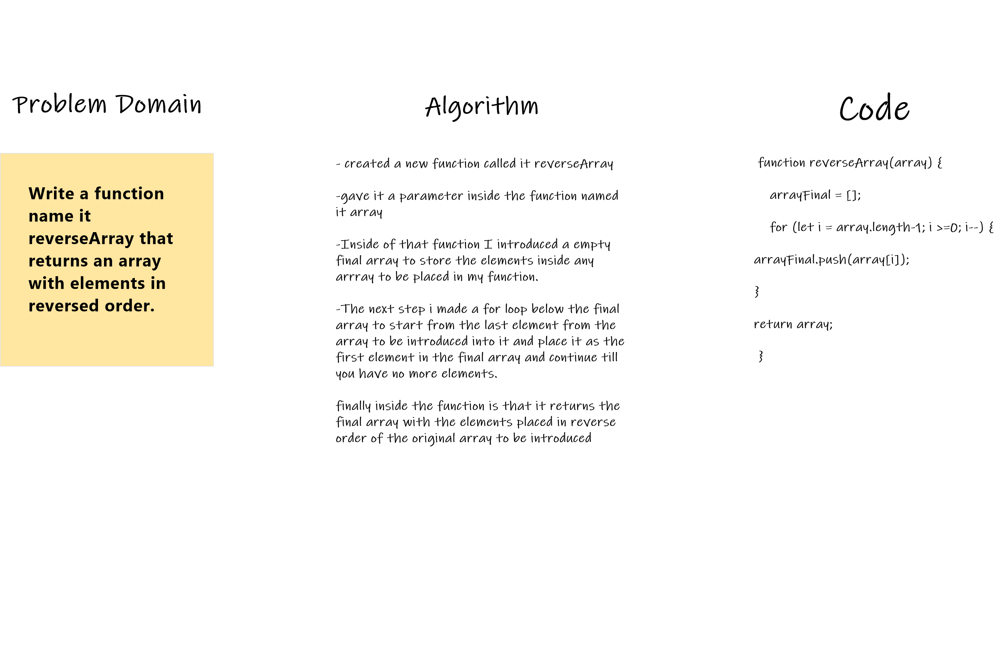

# Reverse an Array
Write a function called reverseArray which takes an array as an argument. Without utilizing any of the built-in methods available to your language, return an array with elements in reversed order.
Example

## Whiteboard Process

## Approach & Efficiency
I used a for loop inside a function to reverse any array to be introduced. I used this method as i know it very well.