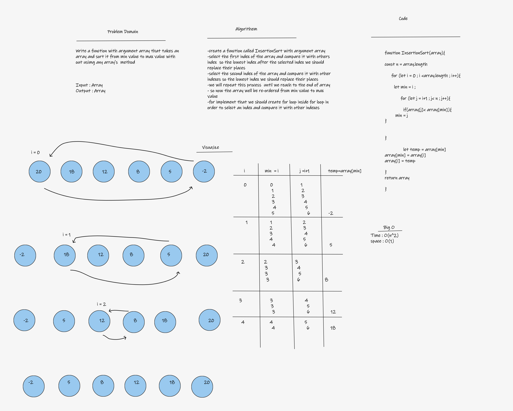

# Challenge Summary

Insertion sort is a simple sorting algorithm that works similar to the way you sort playing cards in your hands. The array is virtually split into a sorted and an unsorted part. Values from the unsorted part are picked and placed at the correct position in the sorted part.

## Whiteboard Process

## Approach & Efficiency

Big O Time : O(n^2)
Big O Space : O(1)