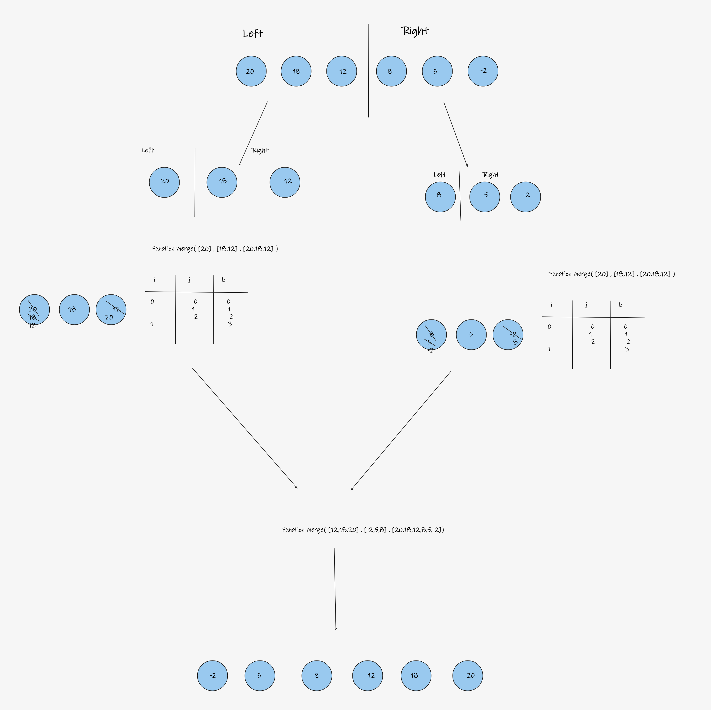

# Challenge Summary

Merges two arrays. Accept two arrays, and it needs to sort the two arrays correctly starting from the smallest element. With that you merge sort ready.

## Whiteboard Process

## Approach & Efficiency

Big O Time : O(n*log n)
Big O Space : O(1)