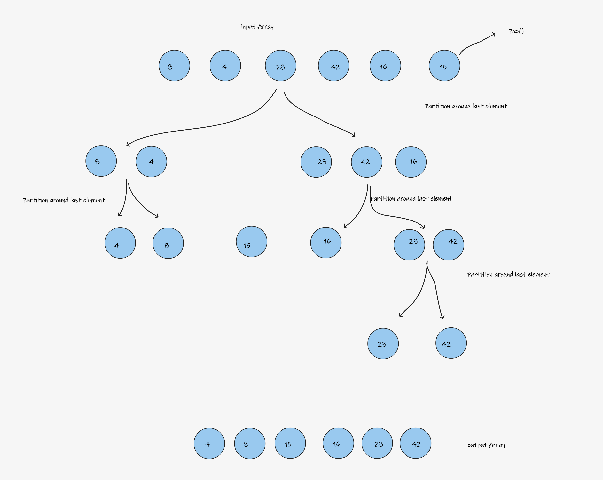

# Challenge Summary

A sorting technique that sequences a list by continuously dividing the list into two parts and moving the lower items to one side and the higher items to the other.

## Whiteboard Process

## Approach & Efficiency

Big O Time : O(log n)
Big O Space : O(1)
