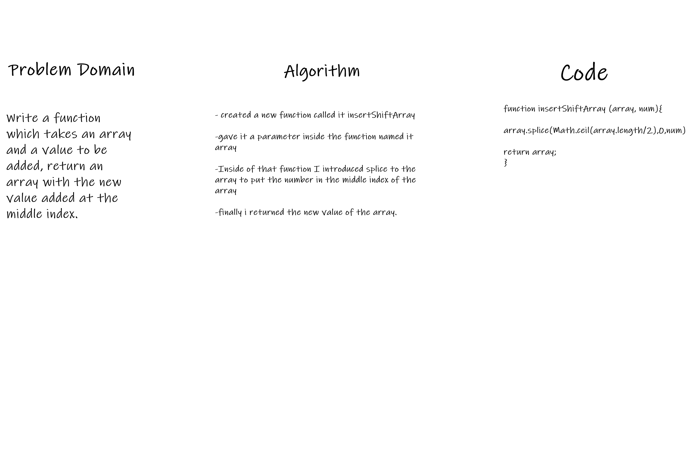

# Insert to Middle of an Array
Write a function called insertShiftArray which takes in an array and a value to be added. Without utilizing any of the built-in methods available to your language, return an array with the new value added at the middle index.

## Whiteboard Process

## Approach & Efficiency
it took me about an hour i used splice which you dectate the index and what you want to add and it adds it as it was the only way i could think of to do this.
