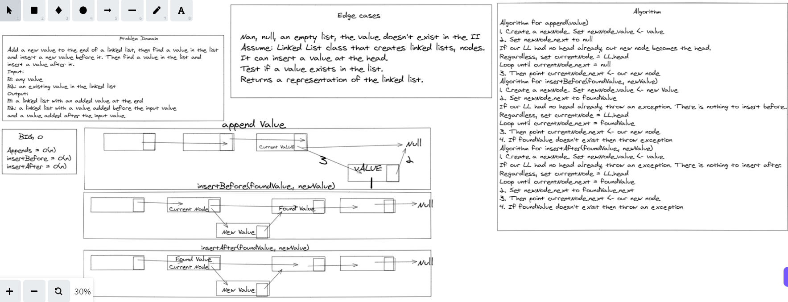

# Challenge Summary
Write methods for the Linked List class to append
arguments new value and adds a new node with the given value to the end of the list, also insert before arguments value, new value and adds a new node with the given new value immediately before the first node that has the value specified, also insert after arguments value, new value and adds a new node with the given new value immediately after the first node that has the value specified

## Whiteboard Process

## Approach & Efficiency

* LinkedList.append() - O(n)
* LinkedList.insertBefore() - O(1) (plus time to search for value)
* LinkedList.insertAfter() - O(1) (plus time to search for value)

## Solution

created new methods for the linked list including  append and insertbefore and insertafter first method to add value at the end of the list, next the insert before method added a new value before specified node differeing from insert after that it adds the new value after specified node.