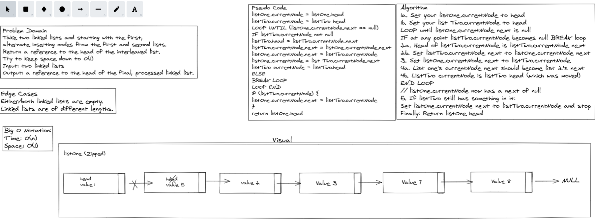

# Challenge Summary
Write a function to Zip two linked lists together into one so that the nodes alternate between the two lists and return a reference to the zipped list.

## Whiteboard Process

## Approach & Efficiency

* Linked-List-zip - O(1)

## Solution

Created a function that takes in two lists and combines them and returns them as one list.