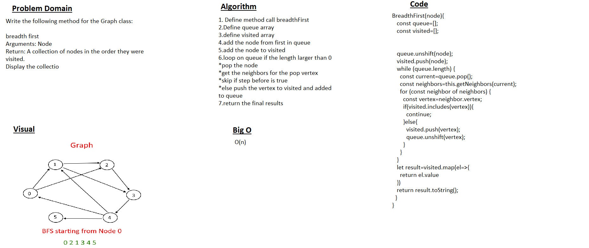

# Challenge Summary

Breadth-first search (BFS) is a method for exploring a tree or graph. In a BFS, you first explore all the nodes one step away, then all the nodes two steps away, etc. Breadth-first search is like throwing a stone in the center of a pond. The nodes you explore "ripple out" from the starting point.

## Whiteboard Process

## Approach & Efficiency

Big O : O(n)
