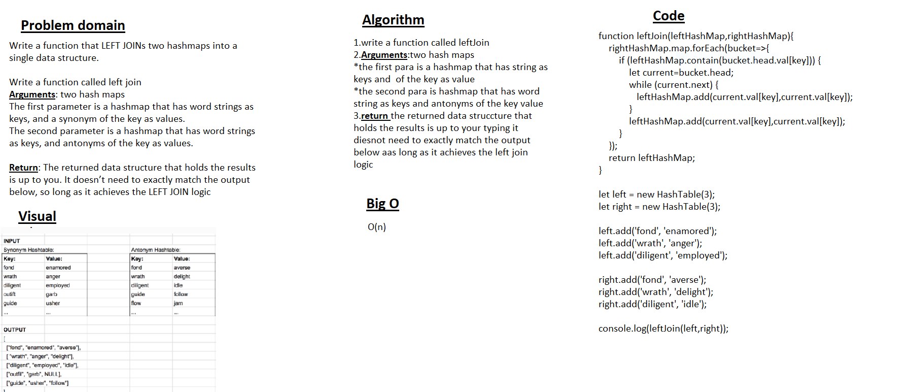

# Hashmap Left Join

type in terminal => node index.js <= to test

### Challenge Summary

Hashtables are a data structure that utilize key value pairs. This means every Node or Bucket has both a key, and a value.

## Whiteboard Process

## Approach & Efficiency

Big O Space: O(n)
Big O Time: O(n)
