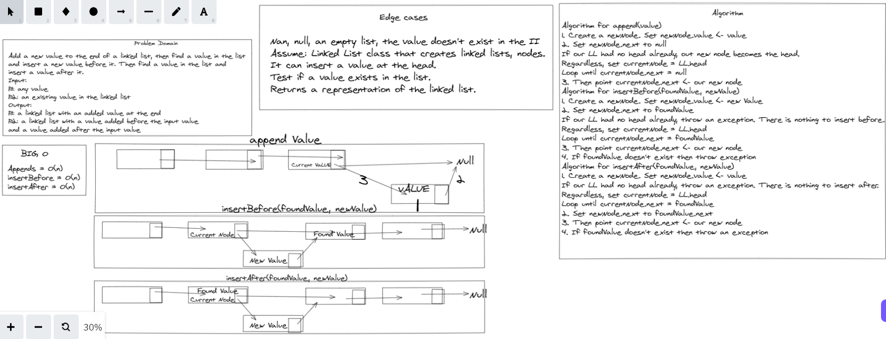
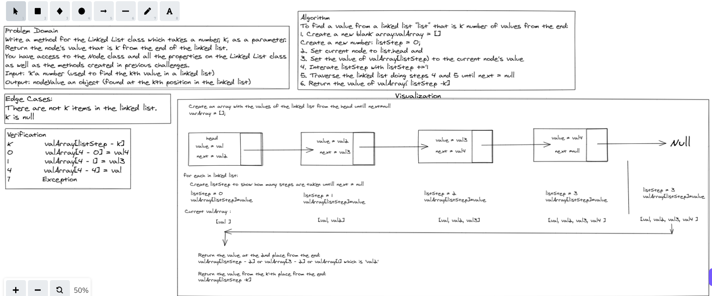

# Singly Linked List Implementation

Single list is used to added one node at at time at multiple locations and testing them.

## Challenge

I implemented single linked list and tested them according to request of challenge

## Approach & Efficiency

i followed the approach given to me in class

# Linked List Insertions

## Challenge Summary

Write methods for the Linked List class to append
arguments new value and adds a new node with the given value to the end of the list, also insert before arguments value, new value and adds a new node with the given new value immediately before the first node that has the value specified, also insert after arguments value, new value and adds a new node with the given new value immediately after the first node that has the value specified

## Whiteboard Process

## Approach & Efficiency

* LinkedList.append() - O(n)
* LinkedList.insertBefore() - O(1) (plus time to search for value)
* LinkedList.insertAfter() - O(1) (plus time to search for value)

## Solution

created new methods for the linked list including  append and insertbefore and insertafter first method to add value at the end of the list, next the insert before method added a new value before specified node differeing from insert after that it adds the new value after specified node.

# Linked List kth

## Challenge Summary
Write the following method for the Linked List class kth from end, argument a number k, as a parameter.
Return the node’s value that is k places from the tail of the linked list and you have access to the Node class and all the properties on the Linked List class

## Whiteboard Process

## Approach & Efficiency

* LinkedList.kthFromEnd - O(n)

## Solution

Wrote a code to pass the following tests and therefor is working as expected.
test when k is greater than the length of the linked listalso when k and the length of the list are the same and k is not a positive integer and also when the linked list is of a size 1 and finally “Happy Path” where k is not at the end, but somewhere in the middle of the linked list
