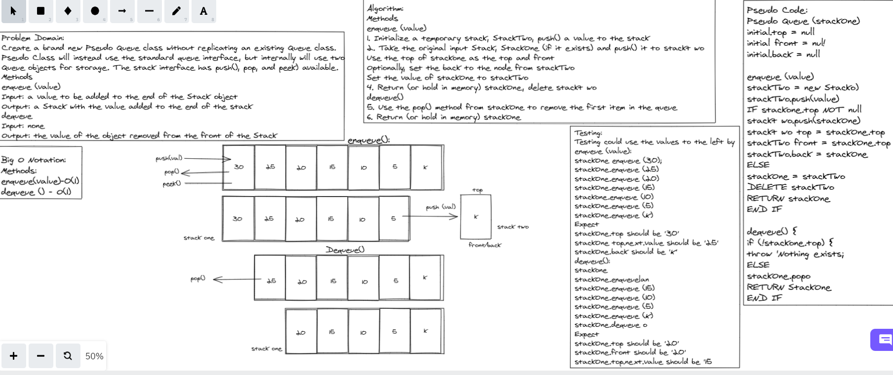
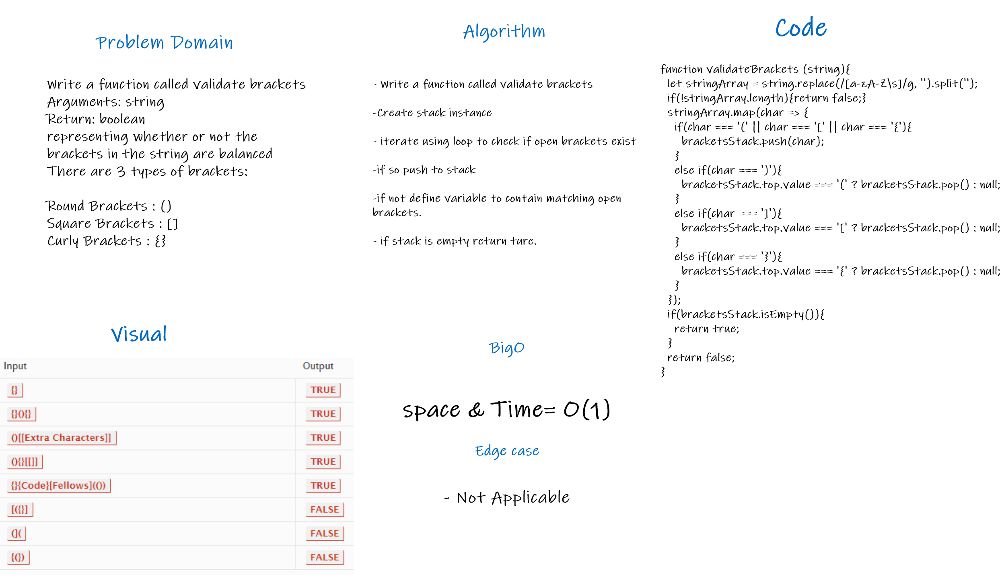

# Stacks and Queues

Using a Linked List as the underlying data storage mechanism, implement both a Stack and a Queue.

## Challenge

* Node
Create a Node class that has properties for the value stored in the Node, and a pointer to the next node.

* Stack
Create a Stack class that has a top property.

* push
* pop
* peek
* is empty

* Queue

* enqueue
* dequeue
* peek
* is empty

## Approach & Efficiency

All methods on all classes are O(1) for time and space.

# Stack-Queue-Pseudo

## Challenge Summary

Create a new class called pseudo queue, this PseudoQueue class will implement our standard queue interface, utilize 2 Stack instances to create and manage the queue using the following methods, enqueue with a Argument: value to insert value into the PseudoQueue, using a first-in, first-out approach. Also dequeue with a Argument: none to Extract a value from the PseudoQueue, using a first-in, first-out approach.

## Whiteboard Process

## Approach &-Efficiency

O(1) for Both Methods

## Solution

enqueue (value)

1. Initialize a temporary stack; StackTwo, push() a value to the stack
2. Take the original input Stack, Stackone (if it exists) and push() it to stackt wo
Use the top of stackone as the top and Front
Optionally, set the back to the node from stackTwo
Set the value of stackone to stackTwo
4. Retuen (or hold in memory) stackone, delete stackt wo
dequeue()
5. Use the pop method from stackone to remove the first item in the queue
6. Return (or hold in memory) StackOne.

# Stack Queue Animal Shelter

## Challenge Summary

Create a class called AnimalShelter which holds only dogs and cats. Implement the following methods, enqueue with an argument "animal" which can be either a dog or a cat object, Dequeue argument "pref" which can be either "dog" or "cat", return; either a dog or a cat, based on preference and if pref is not "dog" or "cat" then return null.

## Whiteboard Process

## Approach &-Efficiency

O(1) for Both Methods

## Solution

The shelter operates using a first-in, first-out approach. The following methods were implemented enqueue with an argument "animal" which can be either a dog or a cat object & dequeue argument "pref" which can be either "dog" or "cat" & returns either a dog or a cat, based on preference and if pref is not "dog" or "cat" then return null.

# Stack Queue Brackets

## Challenge Summary

Write a function called validate brackets; Arguments: string; Return: boolean; representing whether or not the brackets in the string are balanced.
There are 3 types of brackets; Round Brackets : (); Square Brackets : []; Curly Brackets : {}

## Whiteboard Process

## Approach &-Efficiency

O(1) for Both Methods

## Solution

Write a function called validate brackets, create stack instance, iterate using loop to check if open brackets exist, if so push to stack, if not define variable to contain matching open brackets, if stack is empty return ture.
