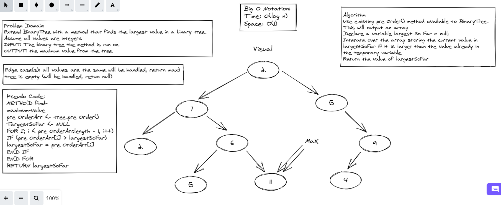

# Challenge Summary
Write the following method for the Binary Tree class find maximum value, Arguments: none, Returns: number,
Find the maximum value stored in the tree. You can assume that the values stored in the Binary Tree will be numeric.

## Whiteboard Process

## Approach & Efficiency

BigO space = O(1), time = O(n^2)

## Solution
created max-tree to finad max in binary tree