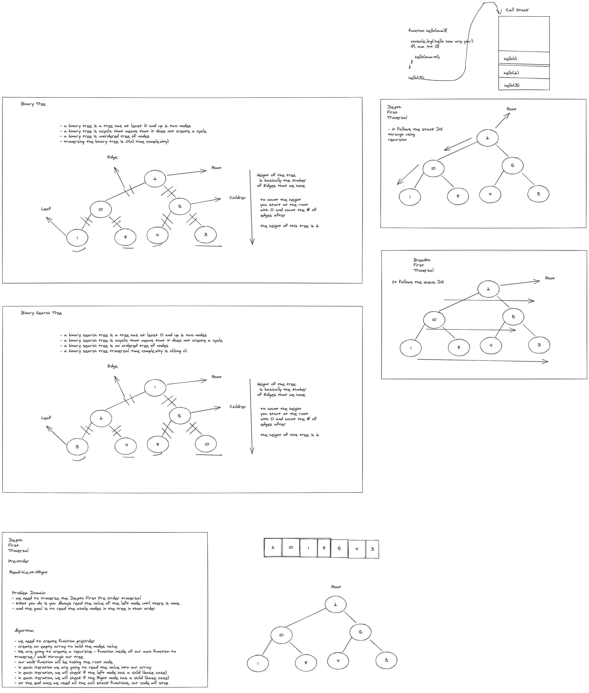
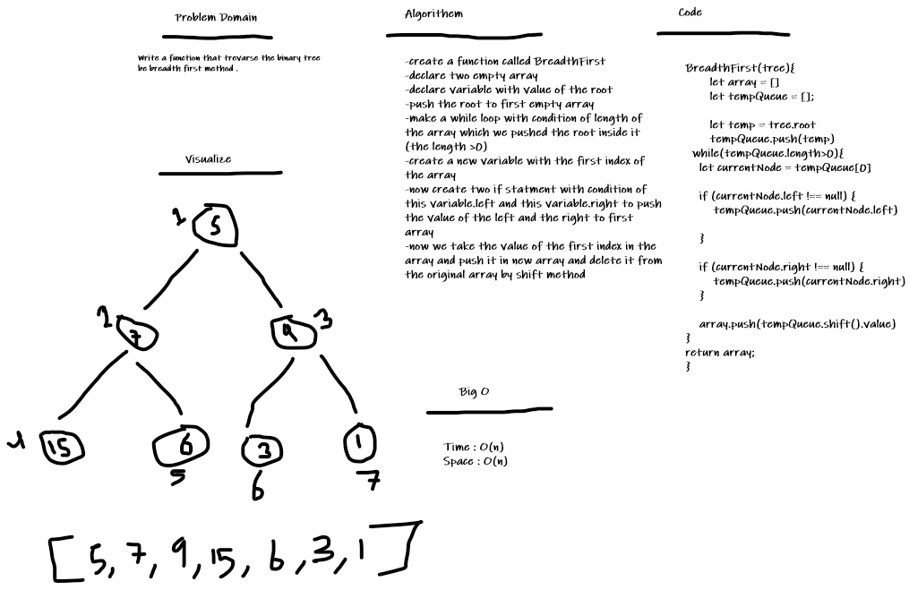

# Trees

A tree is a data structure where a node can have zero or more children. Each node contains a value. Like graphs, the connection between nodes is called edges.

### Challenge

Node
Create a Node class that has properties for the value stored in the node, the left child node, and the right child node.

Binary Tree
Create a Binary Tree class: Define a method for each of the depth first traversals:
pre order, in order, post order which returns an array of the values, ordered appropriately.
Any exceptions or errors that come from your code should be semantic, capture-able errors. For example, rather than a default error thrown by your language, your code should raise/throw a custom, semantic error that describes what went wrong in calling the methods you wrote for this lab.

Binary Search Tree
Create a Binary Search Tree class
This class should be a sub-class (or your languages equivalent) of the Binary Tree Class, with the following additional methods:

Add
Arguments: value
Return: nothing
Adds a new node with that value in the correct location in the binary search tree.

Contains
Argument: value,
Returns: boolean indicating whether or not the value is in the tree at least once.

### Whiteboard Process

### Approach & Efficiency

Big O Space = O(1), Time = O(1) to O(n^2)

## Max-tree

### Challenge Summary

Write the following method for the Binary Tree class find maximum value, Arguments: none, Returns: number,
Find the maximum value stored in the tree. You can assume that the values stored in the Binary Tree will be numeric.

### Whiteboard Process

### Approach & Efficiency

BigO space = O(1), time = O(n^2)

### Solution

created max-tree to finad max in binary tree

## Tree Breadth First

### Challenge Summary

Write a function called breadth first, Arguments: tree,
Return: list of all values in the tree, in the order they were encountered

### Whiteboard Process

### Approach & Efficiency

both methods O(n)
